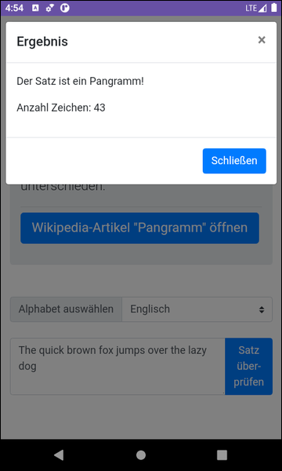

# Boostrap-Webapp mit WebView in nativer Android-App #

 

Native Android-App mit Java, die eine mit dem CSS-Framework [Bootstrap](https://getbootstrap.com/) erstelle
Web-App im [WebView](https://developer.android.com/reference/android/webkit/WebView)-Element von Android darstellt.
Bei der Web-App handelt es sich um einen einfachen [Pangramm](https://de.wikipedia.org/wiki/Pangramm)-Checker.

 

----

## Screenshots ##

 

 &nbsp; 

 

----

## License ##

 

See the [LICENSE file](LICENSE.md) for license rights and limitations (BSD 3-Clause License).

 
