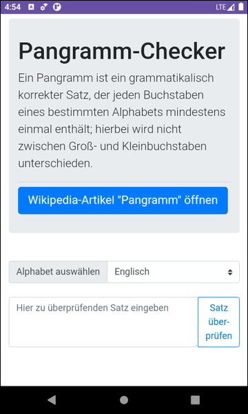

# Boostrap-Webapp mit WebView in nativer Android-App #

 

Native Android-App mit Android, die eine mit Bootstrap erstelle Web-App im WebView-Element darstellt.

 

----

## Screenshots ##

 

 &nbsp; 

 

----

## License ##

 

See the [LICENSE file](LICENSE.md) for license rights and limitations (BSD 3-Clause License).

 
